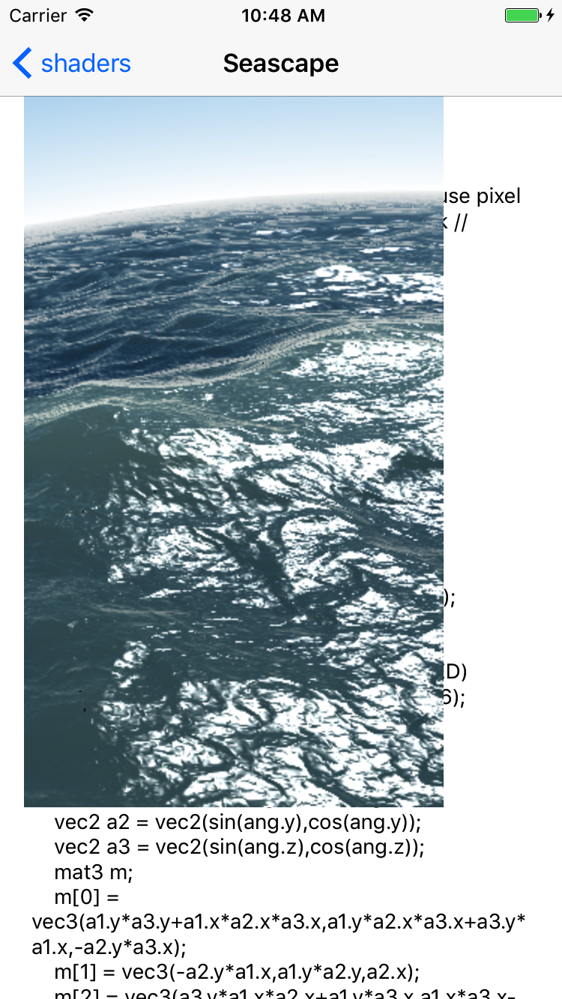

# shader from http://shadertoy.com in iOS app
# SimpleFragment

# Creation

# TheDriveHome

# Seascape

# Clouds

# MengerSponge

TODO:

https://www.shadertoy.com/results?query=&sort=love&from=564&num=12

program upgrade required

syntax errors
Atmosphere system test
https://www.shadertoy.com/view/XtBXDz
sparks
https://www.shadertoy.com/view/4ss3DM
StarNest
https://www.shadertoy.com/view/XlfGRj

iChannelResolution[4]
cloud ten. 
https://www.shadertoy.com/view/XtS3DD

channel2
furrball  
https://www.shadertoy.com/view/XsfGWN
voxel edges
https://www.shadertoy.com/view/4dfGzs

bufA
red palanet 
https://www.shadertoy.com/view/XsyGWV

bufA
bufB
black hole
https://www.shadertoy.com/view/lstSRS

channel0
channel1
Ray Marching Experiment n°35
https://www.shadertoy.com/view/4t2SWW

