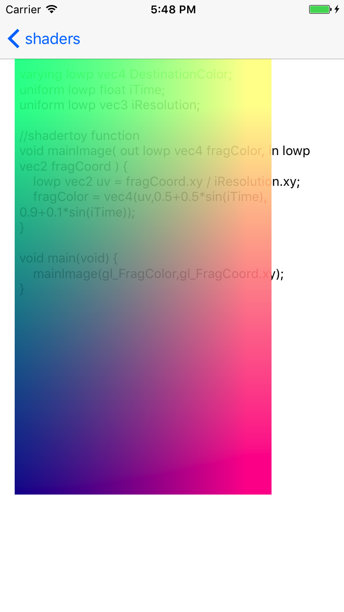
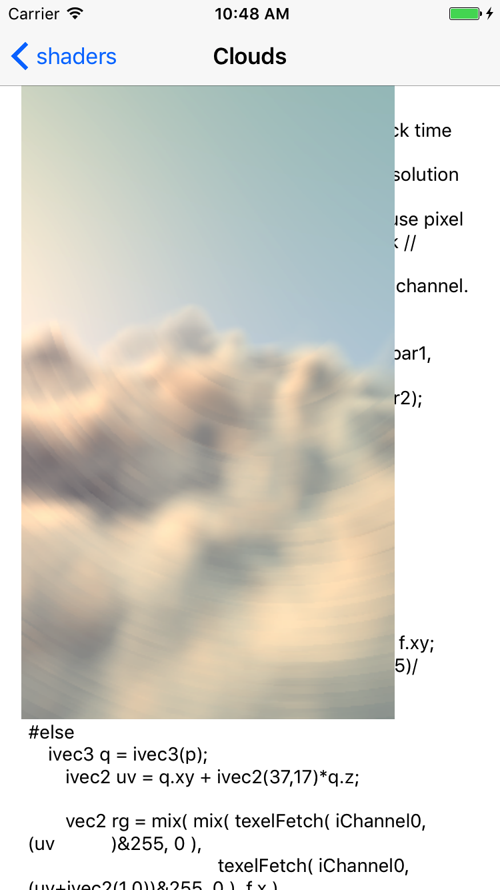
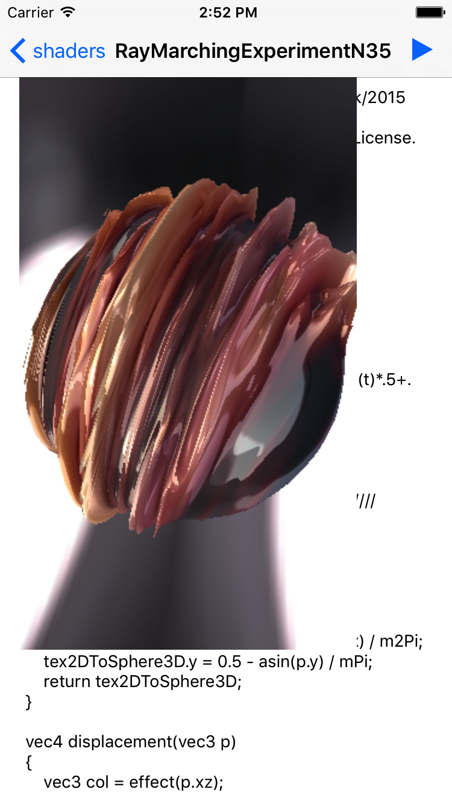
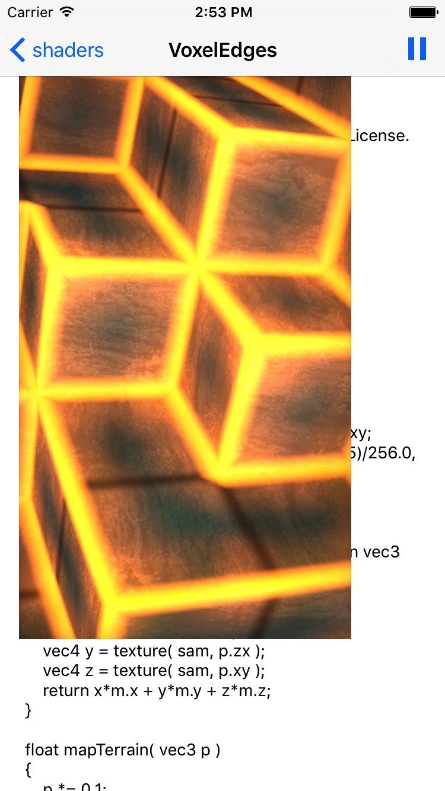

# shader from http://shadertoy.com in iOS app
# SimpleFragment

# Creation

# TheDriveHome

# Seascape

# Clouds

# CloudTen

# MengerSponge

# RayMarchingExperimentN35

# VoxelEdges

# WetStone

TODO:

https://www.shadertoy.com/results?query=&sort=hot&from=1068&num=12

https://www.shadertoy.com/view/4sSBzy
https://www.shadertoy.com/view/lslfRN
https://www.shadertoy.com/view/lslSRf
https://www.shadertoy.com/view/XtX3R2
https://www.shadertoy.com/view/XsSGDy

program upgrade required

bufA
bufB
black hole
https://www.shadertoy.com/view/lstSRS
red palanet 
https://www.shadertoy.com/view/XsyGWV
https://www.shadertoy.com/view/MsGSRd
https://www.shadertoy.com/view/XdSBDw
https://www.shadertoy.com/view/XlcSDr
https://www.shadertoy.com/view/Xsd3DB
https://www.shadertoy.com/view/MdX3Rr
https://www.shadertoy.com/view/Xd33Ds

